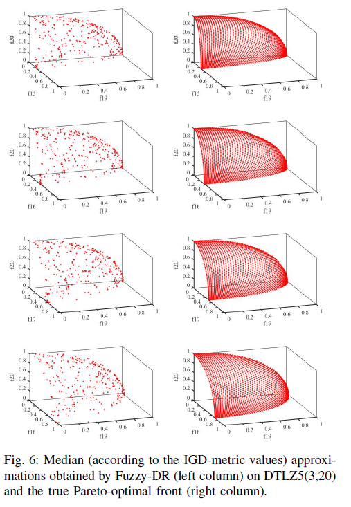
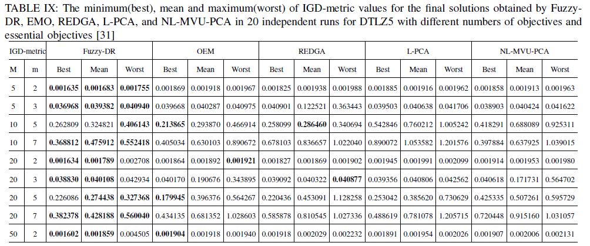

# Objective-Extraction-via-Fuzzy-Clustering-in-Evolutionary-Many-Objective-Optimization

## Abstract
Most existing multi-objective optimization algorithms failed to find a well-representative set of Pareto solutions when the number of objectives is greater than three. This kind of problem is defined as many-objective optimization problems(MaOPs). Thus, many-objective optimization algorithms are proposed and aimed to address this problem. Improving algorithm’s ability to address MaOPs and simplifying the original optimization problems are two approaches that lead us to design algorithms. Inspired by some works that use dimensionality
reduction method to simplify original optimization problems, in this paper, we proposed an objective extraction method via fuzzy clustering, which constructs the simplified objective as a linear combination of membership matrix and the original objectives. The main difference between the existing dimensionality reduction method, based on feature selection, and our method is that we do not ignore any original objectives when we construct a simplified problem. Each original objective make contribution to the simplified optimization problem according to the result of fuzzy clustering, based on correlation. Extensive experimental studies are conducted to reveal the performance of our method and to compare with other algorithms.

## Experiment results
#### The figures below are the final solution we get and the theoretical Pareto front. 

#### The table below compares our performance (Fuzzy-DR) with other state-of-art algorithms 

